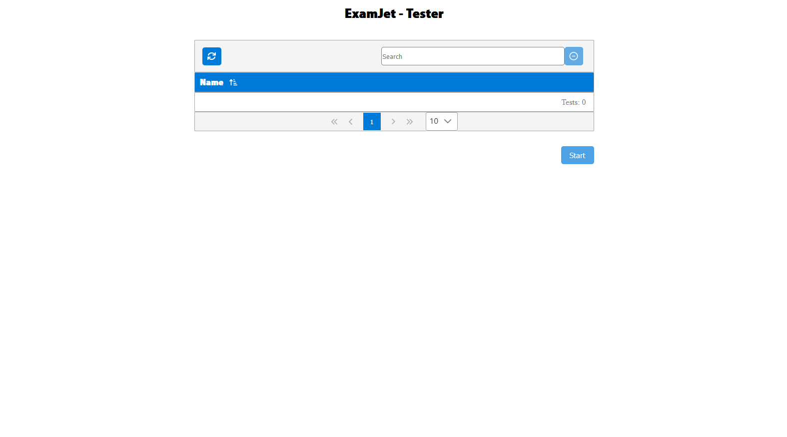

# გამოყენება

* როცა refresh ის ღილაკს დააჭერ ფაილი გადმოიწერება
* fotoebi/ragaca.zip - ადგილი და ფაილის სახელი(ragaca.zip) - ზუსტად იგივე უნდა იყოს
* შეგიძლია გადმოიწერო მთლიანი რეპო შეცვალო ეგ ფაილი და გაუშვა შენს github-ში გვერდად გამოსაყენებლად

# Screenshot

